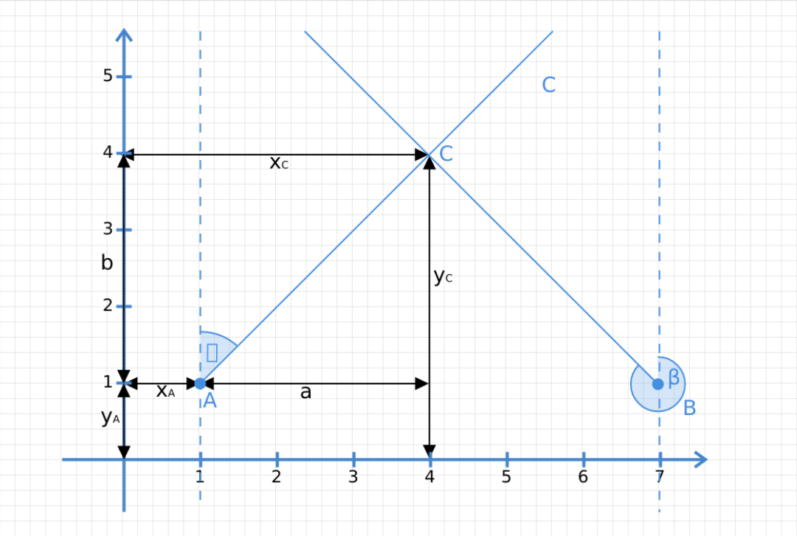

# FindStronghold

A simple utility that allows to find the Minecraft stronghold location based on 2 ender eye throws.
## Usage
#### Jar example usage
```console 
foo@bar:~$ java -cp "picocli-4.6.1.jar:FindStronghold.jar" FindStronghold [1.0,3.0,270.0] [-1.0,3.0,90.0]
```
#### Console utility 
```shell
Usage: findstronghold [-hV] FIRST_THROW SECOND_THROW
Finds the Minecraft stronghold location based on 2 ender eye throws.
      FIRST_THROW    [<x_coordinates>, <y_coordinates>, <angle_from_y>]
      SECOND_THROW   [<x_coordinates>, <y_coordinates>, <angle_from_y>]
  -h, --help         Show this help message and exit.
  -V, --version      Print version information and exit.

```
##### Example
```console
foo@bar:~$ ./findstronghold-linux-amd64 [7.0,1.0,315.0] [1.0,1.0,45.0]
```
## Dependencies used
* [picocli](https://picocli.info/)
* [JUnit 5](https://junit.org/junit5)

## Math
<p align="center">
</br>
</p>
Based on the diagram, an equality can be stated:</br>
<p align="center">
</br>
</p>
Analogously, the same can be written for the second ray:</br>
<p align="center">
</br>
</p>
Combining those equations the y coordinate of the intersection point can be derived:</br>
<p align="center">
</br>
</p>
Plugging in the value into either of the previous equations gives us the x coordinate:</br>
<p align="center">

</p>


